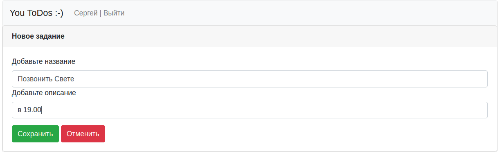
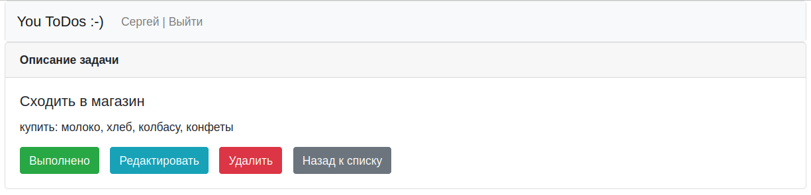
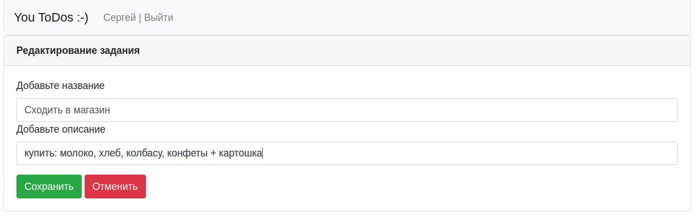

# job4j_todo

[](https://github.com/SergeyPoletaev/job4j_todo/actions)
[](https://codecov.io/gh/SergeyPoletaev/job4j_todo)

### Описание проекта:

Это приложение - сервис по ведению списка повседневных задач. На веб-странице размещаются задачи в виде таблицы:

* ID
* краткое описание
* дата создания
* дата последнего изменения
* статус (новая/выполнено)

Пользоваться сервисом могут только зарегистрированные пользователи.  
Пользователь имеет возможность добавлять, удалять, редактировать задачи.  
Имеется возможность вывода списка задач по фильтру - выполненные и новые.

### Стек технологий:

* Java 17
* Maven 3.8
* Spring Boot 2
* Thymeleaf 3
* Bootstrap 5
* PostgreSQL 14
* Hibernate 5
* Liquibase

### Требования к окружению:

* Java 17
* Maven 3.8
* PostgreSQL 14

### Запуск проекта:

1. Настроить подключение к серверу БД в соответствии с настройками из файла    
   [./job4j_todo/src/main/resources/hibernate.cfg.xml](https://github.com/SergeyPoletaev/job4j_todo/blob/master/src/main/resources/hibernate.cfg.xml)   
   В случае изменения настроек подключения к БД привести в соответствие также настройки в файле  
   [./job4j_todo/db/liquibase.properties](https://github.com/SergeyPoletaev/job4j_todo/blob/master/db/liquibase.properties)
2. Создать базу данных, например через утилиту psql:

``` 
create database todo 
```

3. Создать таблицы нужной структуры и упаковать проект в jar архив. Для этого в папке с проектом выполнить:

``` 
mvn package -Pproduction 
```  

Архив jar будет находится по пути: ./job4j_todo/target/job4j_todo-1.0.jar

4. Запустить приложение командой:

``` 
java -jar job4j_todo-1.0.jar 
```

### Взаимодействие с приложением:

*регистрируемся ...*


*аутентифицируемся ...*


*список всех задач ...*


*добавляем новую ...*



*смотрим подробное описание ...*



*редактируем ...*



---

### Контакты

telegram: [@svpoletaev](https://t.me/svpoletaev)
